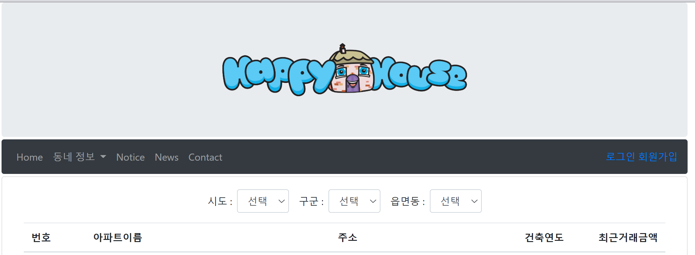

# HappyHouse_Framework_서울_12반_배현중_양은서

<h1>1. 메인화면 </h1>
<h4>로그인을 하지 않은 기본 상태에서는 로그인, 회원가입으로 넘어갈 수 있도록 구현.</h4>

<h1>2. 로그인 화면 </h1>
<h4>아이디 저장을 클릭시 다음 로그인 시도시에 아이디를 저장해놓도록 구현.</h4>

<h2>2-1. 로그인 성공화면</h2>
<h4>일반 사용자 로그인 성공화면</h4> 

<h2>2-2. 관리자 로그인 성공화면</h2>
<h4>관리자는 추가적으로 회원을 관리할 수 있는 화면으로 이동할 수 있도록 구현</h4>

<h1>3. 회원가입 화면 </h1>

<h2>중복  아이디 검사</h2>

<h1>4. 회원관리 화면 </h1>
<h4>4-1. 회원가입</h4>

<h4>등록된 사용자 확인</h4>

<h4>4-2. 회원 정보 수정 </h4>

<h4>4-3. 회원 정보 삭제 </h4>

<h4>4-4. 회원 정보 조회</h4>

<h4>4-5. 회원 정보 검색</h4>

<h1>5. 공지사항 화면 </h1>
<h4>5-1. 공지사항 리스트<h4>

<h4>5-2. 공지사항 검색<h4>

<h4>5-3. 공지사항 작성<h4>

<h4>5-4. 공지사항 작성 성공<h4>

<h4>5-5. 공지사항 작성 후 리스트 화면<h4>

<h4>5-6. 공지사항 수정<h4>

<h4>5-7. 공지사항 수정 성공<h4>

<h4>5-8. 공지사항 수정<h4>

<h4>5-9. 공지사항 수정 후 리스트 화면<h4>

<h4>5-10. 공지사항 삭제 성공<h4>

<h4>5-11. 공지사항 삭제 성공 후 리스트 화면<h4>

