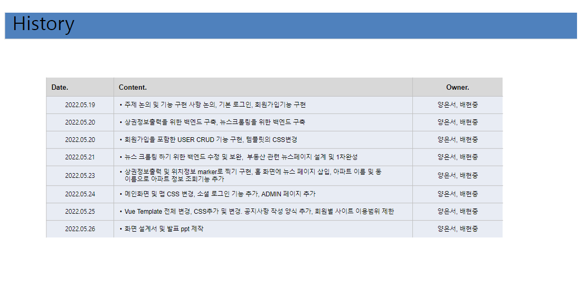
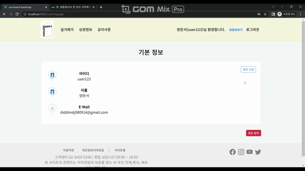
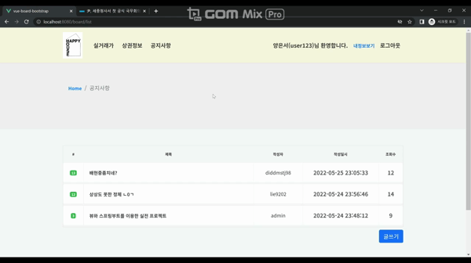

# HappyHouse*final*서울*12반*양은서\_배현중

## Happy House

-  SSAFY JAVA트랙 1학기 관통 파이널 프로젝트입니다.
     

## 프로젝트 기간

-  2022년 05월 19일 ~ 2022년 05월 26일
   
     

## 기술 스택

   
   
   
   
    
   
   
  
  
  

    

## 실행화면

### 메인페이지 - 키워드 검색

✅ 동, 아파트이름 중 검색어의 일부 혹은 전체를 입력하면 관련 매물을 마커로 표시

  

---

### 메인페이지 - 뉴스 API 및 공지사항

✅ 뉴스API를 활용해 부동산 관련 뉴스리스트를 제시.
 
✅ 공지사항의 목록중 가장 최신의 것 5개를 뽑아 메인 화면에서 제시.

##   

---

### 회원가입 및 로그인

✅ 아이디 중복체크를 통해 중복된 회원 아이디로는 가입불가.

##   

### 회원정보 수정

✅ 알맞은 비밀번호를 입력한다면 회원 정보의 수정이 가능함.

  

### 회원탈퇴

✅ 알맞은 비밀번호를 입력한다면 탈퇴가 가능함.

  

---

### 동검색

✅ 지역구, 동을 선택해 해당 지역 매물의 정보를 조회할 수 있음. 
✅ 매물의 위치를 마커를 통해서 확인 할 수 있으며, 마커를 클릭시 보다 자세한 실거래 정보를 조회할 수 있음.

  

---

### 상권검색

✅ 지역구, 동을 선택하고 [교육,스포츠,음식] 카테고리중 하나를 선택한다면 해당 상권의 정보를 제시함. 
✅ 상권의 위치를 마커로 지도에 표시함. 마커를 클릭시 보다 자세한 상권의 정보를 확인가능함.

##   

---

### 공지사항

✅ 로그인 한 사용자는 공지사항을 작성할 수 있다.  
✅ 공지사항 리스트를 조회 할 수 있음. (글 번호, 글 작성자, 글제목, 글 조회수, 글 작성일자) 
✅ 글 작성자는 해당 공지사항을 수정할 수 있는 권한이 있음.  
✅ 글 작성자는 해당 공지사항을 삭제할 수 있는 권한이 있음.

